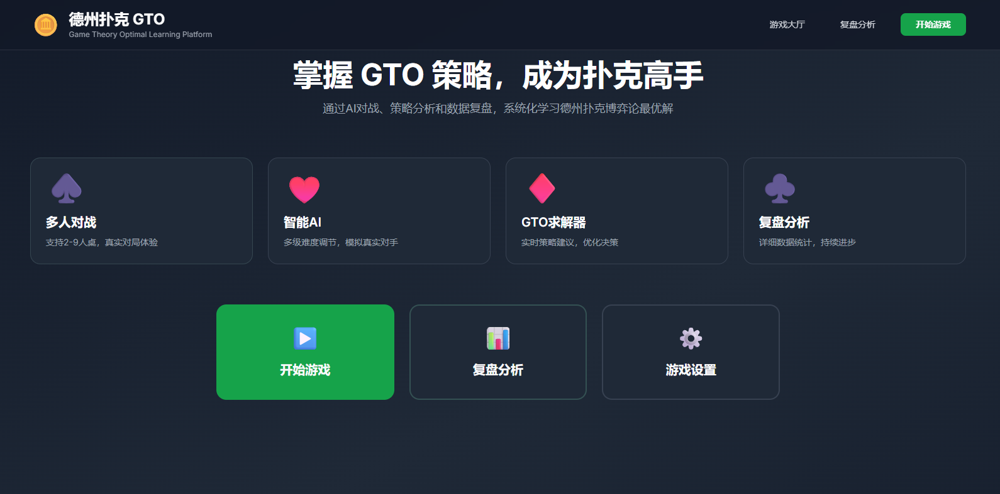
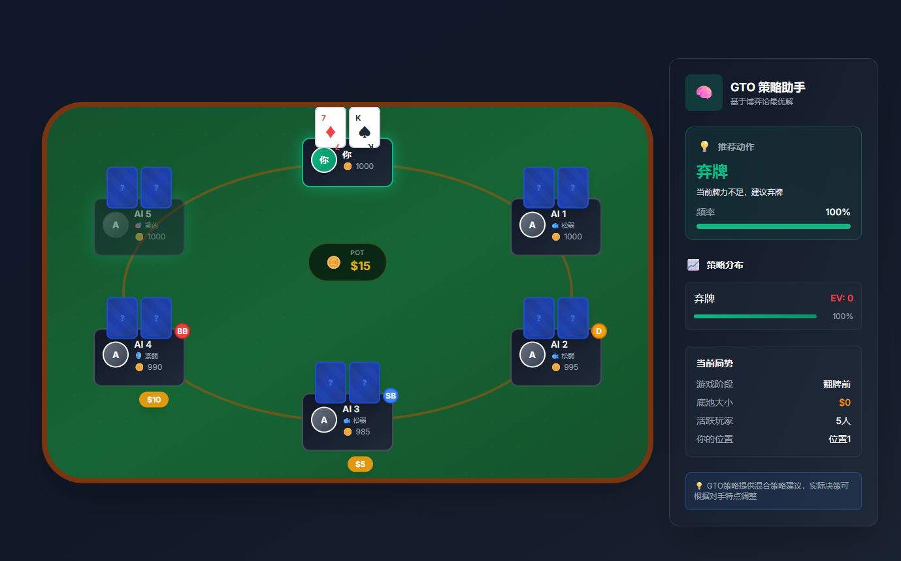
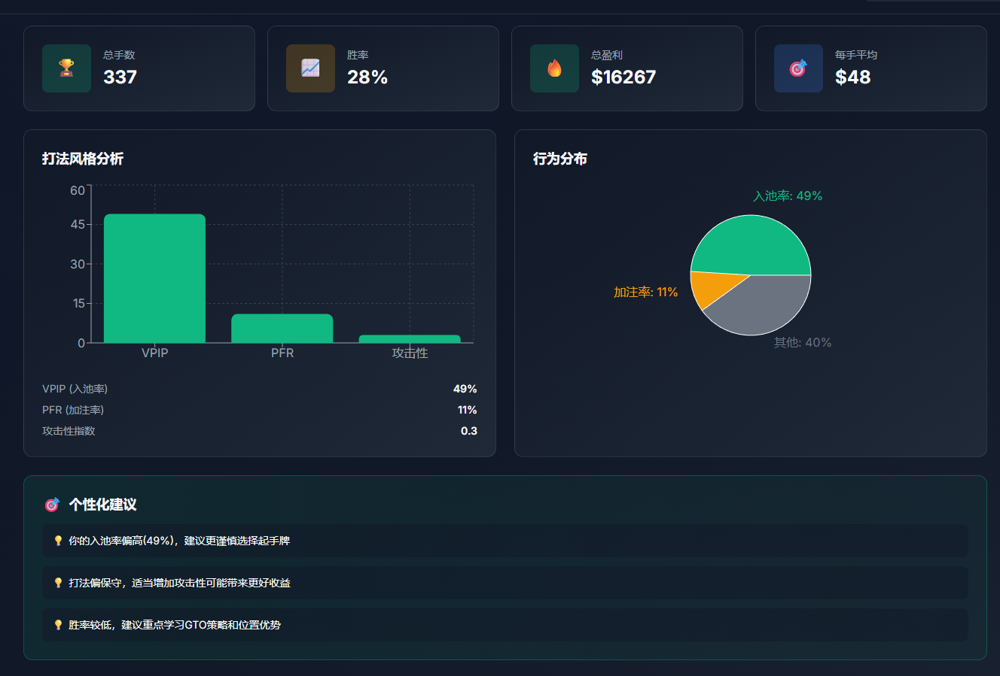
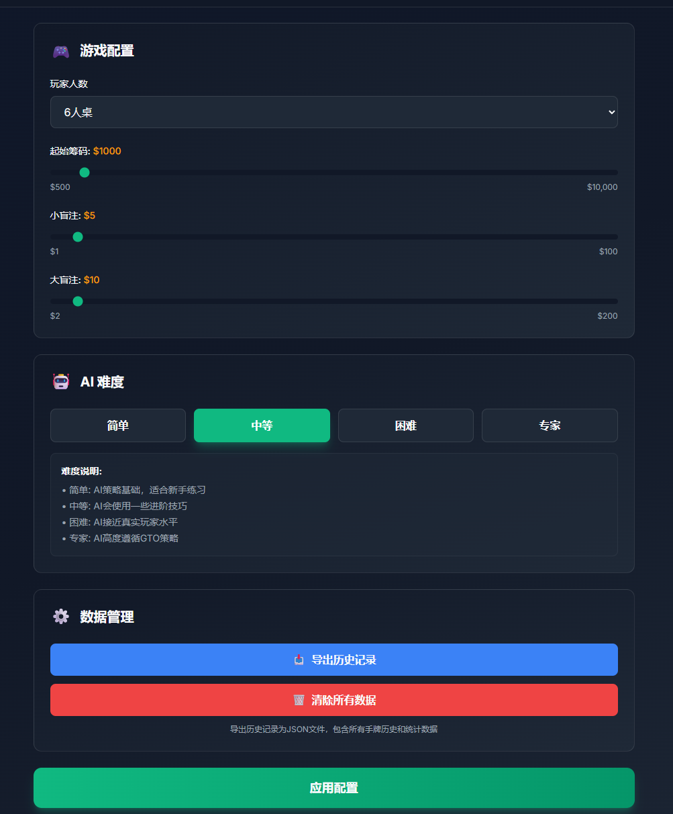

# 🃏 Texas Hold'em GTO Trainer | 德州扑克 GTO 训练器

<p align="center">
  
  
  
  
  
</p>

<p align="center">
  A modern Texas Hold'em poker training application with real-time GTO (Game Theory Optimal) strategy assistance.<br>
  现代化德州扑克训练应用，提供实时 GTO（博弈论最优）策略辅助。
</p>

<p align="center">
  <a href="#-features--功能特性">Features</a> •
  <a href="#-screenshots--界面展示">Screenshots</a> •
  <a href="#-quick-start--快速开始">Quick Start</a> •
  <a href="#-project-structure--项目结构">Structure</a> •
  <a href="#-gto-concepts--gto-概念">GTO Concepts</a> •
  <a href="#-contributing--贡献指南">Contributing</a>
</p>

---

## 📸 Screenshots | 界面展示

### Home Page | 主页
<p align="center">
  
</p>

### Game Play | 游戏界面
<p align="center">
  
</p>

### Analysis & Statistics | 数据分析
<p align="center">
  
</p>

### Settings | 游戏设置
<p align="center">
  
</p>

---

## ✨ Features | 功能特性

### 🎮 Complete Poker Experience | 完整扑克体验
- **2-8 Player Support**: Configurable table size | 支持 2-8 人，可配置桌位
- **Full Game Flow**: Preflop → Flop → Turn → River → Showdown | 完整游戏流程：翻前 → 翻牌 → 转牌 → 河牌 → 摊牌
- **Realistic Mechanics**: Blinds, pot management, side pots | 真实机制：盲注、底池管理、边池

### 🤖 Intelligent AI System | 智能 AI 系统
- **4 Difficulty Levels**: Easy / Medium / Hard / Expert | 4 种难度：简单 / 中等 / 困难 / 专家
- **4 Playing Styles | 4 种风格**:
  - **TAG** (Tight-Aggressive): Plays few hands but plays them strong | 紧凶型：手牌少但打法凶狠
  - **LAG** (Loose-Aggressive): Plays many hands aggressively | 松凶型：手牌多且激进
  - **TAP** (Tight-Passive): Conservative and cautious | 紧弱型：保守谨慎
  - **LAP** (Loose-Passive): Calls often, rarely raises | 松弱型：常跟注，少加注
- **GTO-Based Decisions**: AI follows optimal strategy based on difficulty | 基于 GTO 决策：AI 根据难度遵循最优策略

### 📊 Real-time GTO Assistant | 实时 GTO 助手
- **Action Recommendations**: Fold / Check / Call / Raise suggestions | 行动建议：弃牌 / 过牌 / 跟注 / 加注
- **Mixed Strategy Frequencies**: Percentage-based recommendations | 混合策略频率：基于百分比的建议
- **EV Calculations**: Expected value for each action | EV 计算：每个行动的期望值
- **Position-aware Advice**: Adjusts strategy based on table position | 位置感知：根据位置调整策略

### 📈 Analysis & Statistics | 分析与统计
- **Hand History**: Complete record of all played hands | 手牌历史：所有对局完整记录
- **Player Statistics | 玩家统计**:
  - VPIP (Voluntarily Put $ In Pot) | VPIP（主动入池率）
  - PFR (Pre-Flop Raise) | PFR（翻前加注率）
  - Aggression Factor | 激进因子
  - Win Rate | 胜率
- **Hand Replay**: Review and analyze past decisions | 手牌回放：复盘分析历史决策

### 💾 Data Persistence | 数据持久化
- **Local Storage**: All data stored in IndexedDB | 本地存储：所有数据存于 IndexedDB
- **Export Function**: Download history as JSON | 导出功能：下载历史为 JSON
- **No Server Required**: Fully client-side application | 无需服务器：纯客户端应用

---

## 🚀 Quick Start | 快速开始

### Prerequisites | 前置要求

- Node.js 18+ 
- npm or yarn or pnpm

### Installation | 安装

```bash
# Clone the repository | 克隆仓库
git clone https://github.com/offlinechen/AI-poker---GTO-exercise.git
cd AI-poker---GTO-exercise

# Install dependencies | 安装依赖
npm install

# Start development server | 启动开发服务器
npm run dev
```

### Build for Production | 生产构建

```bash
npm run build
npm run preview
```

---

## 📁 Project Structure | 项目结构

```
src/
├── components/              # React UI Components | React UI 组件
│   ├── common/              # Reusable components | 可复用组件
│   │   ├── PlayerSeat.tsx   # Player display | 玩家显示
│   │   └── PokerCard.tsx    # Card rendering | 卡牌渲染
│   ├── game/                # Game components | 游戏组件
│   │   ├── GamePage.tsx     # Main game page | 游戏主页
│   │   ├── PokerTable.tsx   # Poker table layout | 牌桌布局
│   │   ├── ActionPanel.tsx  # Action buttons | 操作按钮
│   │   ├── GTOAssistant.tsx # Strategy sidebar | 策略侧边栏
│   │   └── ShowdownModal.tsx# Results modal | 结果弹窗
│   ├── analysis/            # Analysis components | 分析组件
│   │   ├── AnalysisPage.tsx # Analysis main page | 分析主页
│   │   ├── HandHistoryList.tsx
│   │   └── StatsOverview.tsx
│   └── settings/
│       └── SettingsPage.tsx # Game settings | 游戏设置
│
├── engine/                  # Core Game Logic | 核心游戏逻辑
│   ├── game-logic/
│   │   └── GameEngine.ts    # Game state machine | 游戏状态机
│   ├── ai/
│   │   ├── AIEngine.ts      # AI decision engine | AI 决策引擎
│   │   └── PreflopRanges.ts # GTO preflop charts | GTO 翻前范围
│   └── gto/
│       └── GTOSolver.ts     # GTO strategy calculator | GTO 策略计算器
│
├── stores/
│   └── gameStore.ts         # Zustand state management | Zustand 状态管理
│
├── services/
│   ├── database.ts          # IndexedDB operations | IndexedDB 操作
│   └── statsService.ts      # Statistics calculations | 统计计算
│
├── types/
│   ├── index.ts             # Core type definitions | 核心类型定义
│   └── aiStyle.ts           # AI style types | AI 风格类型
│
├── utils/
│   ├── deck.ts              # Deck operations | 牌组操作
│   └── handEvaluator.ts     # Hand evaluation | 牌力评估
│
└── constants/
    └── index.ts             # App constants | 应用常量
```

---

## 🎯 GTO Concepts | GTO 概念

### What is GTO? | 什么是 GTO？

**Game Theory Optimal (GTO)** is a poker strategy that aims to be unexploitable. A GTO strategy ensures that you cannot lose in the long run, regardless of how your opponent plays.

**博弈论最优（GTO）** 是一种追求不可被利用的扑克策略。GTO 策略确保无论对手如何打牌，从长期来看你都不会亏损。

### Key Statistics Explained | 关键统计指标

| Stat 指标 | Description 描述 | Optimal Range 最优范围 |
|------|-------------|---------------|
| **VPIP** | % of hands you voluntarily put money in / 主动入池率 | 20-28% |
| **PFR** | % of hands you raise preflop / 翻前加注率 | 15-22% |
| **AF** | Aggression Factor (bets+raises / calls) / 激进因子 | 2.0-3.5 |

### Hand Tiers | 手牌等级

| Tier 等级 | Examples 示例 | Strategy 策略 |
|------|----------|----------|
| **Premium 顶级** | AA, KK, QQ, AKs | Always raise / 总是加注 |
| **Strong 强牌** | JJ, TT, AQs, AKo | Raise in most positions / 多数位置加注 |
| **Good 好牌** | 99-77, AJs, KQs | Position-dependent / 取决于位置 |
| **Playable 可玩** | Small pairs, suited connectors / 小对子, 同花连牌 | Late position only / 仅后位 |
| **Marginal 边缘** | Weak suited, gap hands / 弱同花, 间隔牌 | Speculative / 投机 |
| **Trash 垃圾** | Everything else / 其他 | Fold / 弃牌 |

---

## 🛠️ Tech Stack | 技术栈

| Category 类别 | Technology 技术 |
|----------|------------|
| **Framework 框架** | React 18 |
| **Language 语言** | TypeScript 5.6 |
| **State Management 状态管理** | Zustand 5.0 |
| **Styling 样式** | Tailwind CSS 3.4 |
| **Animations 动画** | Framer Motion 11 |
| **Database 数据库** | IndexedDB (Dexie.js) |
| **Charts 图表** | Recharts 2.15 |
| **Build Tool 构建工具** | Vite 5.4 |
| **Linting 代码检查** | ESLint 9 |

---

## 🤝 Contributing | 贡献指南

Contributions are welcome! Please read our [Contributing Guide](CONTRIBUTING.md) for details.

欢迎贡献！请阅读 [贡献指南](CONTRIBUTING.md) 了解详情。

### Development | 开发

```bash
# Run development server with hot reload | 启动热重载开发服务器
npm run dev

# Run linting | 运行代码检查
npm run lint

# Build for production | 生产构建
npm run build
```

### Areas for Contribution | 贡献方向

- 🧪 Unit tests and integration tests | 单元测试和集成测试
- 🌍 Internationalization (i18n) | 国际化支持
- 🎨 UI/UX improvements | UI/UX 改进
- 🤖 AI algorithm enhancements | AI 算法优化
- 📊 More statistics and visualizations | 更多统计和可视化
- 📱 Mobile responsiveness | 移动端适配
- ♿ Accessibility improvements | 无障碍改进

---

## 📝 License | 许可证

This project is licensed under the MIT License - see the [LICENSE](LICENSE) file for details.

本项目采用 MIT 许可证 - 详见 [LICENSE](LICENSE) 文件。

---

## 🙏 Acknowledgments | 致谢

- Poker hand evaluation algorithms inspired by classic implementations | 扑克牌力评估算法参考经典实现
- GTO concepts based on modern poker theory | GTO 概念基于现代扑克理论
- UI design inspired by professional poker platforms | UI 设计参考专业扑克平台

---

<p align="center">
  Made with ❤️ for poker enthusiasts<br>
  为扑克爱好者用心打造
</p>
